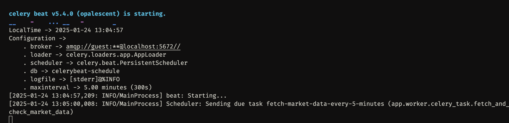
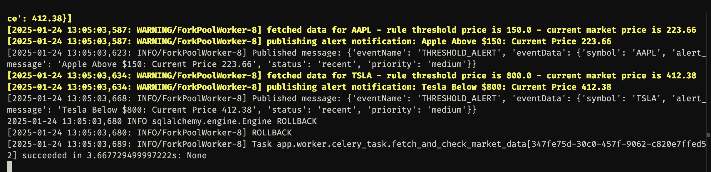

# 📈 Stock Trading API Service

This service allows the user to define alert rules for stock prices, fetch real-time market data, and trigger alerts when thresholds are crossed.

The project is built with **FastAPI**, **RabbitMQ**, and **Celery**.

---

## **Features**

1. **Alert Rules**:
   - Create, update, delete, and retrieve alert rules.
   - Alert rules include a stock symbol and threshold price.

2. **Market Data Updates**:
   - Periodically fetches real-time stock prices for user-defined symbols.

3. **Threshold Alert Notifications**:
   - Detects when stock prices cross rule-defined thresholds.
   - Publishes alerts to RabbitMQ for further processing.

4. **Task Scheduling**:
   - Uses Celery and Celery Beat to schedule tasks to periodically fetch market data and process alerts.

5. **Swagger/OpenAPI Documentation**:
   - Automatically generated API docs at `/docs` or `/redoc` (Thanks FastAPI ❤️).

---

## **Tech Stack**

- **Framework**: [FastAPI](https://fastapi.tiangolo.com/)
- **Asynchronous Database**: SQLAlchemy with CockroachDB
- **Message Broker**: RabbitMQ
- **Task Queue**: Celery
- **Task Scheduler**: Celery Beat
- **HTTP Client**: httpx
- **API Documentation**: OpenAPI (via FastAPI)

---

## **Phases**

### **Phase 1: Core API Endpoints**

**Endpoints**:
- **Alerts**
  - `GET /alerts`: Retrieve all alerts.
- **Alert Rules**
  - `POST /alert_rules`: Create an alert rule.
  - `GET /alert_rules`: Retrieve all alert rules.
  - `PATCH /alert_rules/{id}`: Update an alert rule.
  - `DELETE /alert_rules/{id}`: Delete an alert rule.
- **Market Prices**
  - `POST /market-prices`: Fetch current stock prices.

#### **How to Run and Test Phase 1**
1. Start the FastAPI server:
   ```bash
   uvicorn app.api.main:app --reload
   ```
   or:
   ```bash
   PYTHONPATH="$(pwd)" python app/api/main.py
   ```
2. Access Swagger/OpenAPI Docs:
   - Open your browser and visit `http://localhost:8000/docs`.
3. Test the endpoints:
   - Use Swagger UI or tools like `Postman` and `curl`.


---

### **Phase 2: RabbitMQ Message Enqueueing**

**Features**:
- Publishes `THRESHOLD_ALERT` events to RabbitMQ when stock prices cross thresholds.
- Consumes and processes these alerts from RabbitMQ.

**Setup RabbitMQ**:
- RabbitMQ is managed via Docker Compose.

#### **How to Run and Test Phase 2**
1. Start RabbitMQ via Docker Compose:
    ```bash
   make up
   ```
   or:
    ```bash
   docker-compose up -d
   ```
2. Publish an alert manually:
   ```bash
   PYTHONPATH="$(pwd)" python app/core/message_publisher.py
   ```
3. Start the RabbitMQ consumer:
   ```bash
   PYTHONPATH="$(pwd)" python app/event_subscriber/message_consumer.py
   ```
4. Verify RabbitMQ dashboard:
   - Visit `http://localhost:15672` (Default credentials: `guest/guest`).


---

### **Phase 3: Celery Scheduling**

**Features**:
- Scheduled task to fetch market data every 5 minutes using Celery Beat.
- Publishes alerts to RabbitMQ if thresholds are breached.

#### **How to Run and Test Phase 3**
1. Start Celery Worker:
   ```bash
   PYTHONPATH="$(pwd)" celery -A app.worker.celery_app worker --loglevel=info
   ```
2. Start Celery Beat Scheduler:
   ```bash
   PYTHONPATH="$(pwd)" celery -A app.worker.celery_app beat --loglevel=info
   ```
3. Verify Periodic Tasks:
   - Check logs of the worker to see periodic task execution.
   - RabbitMQ queue will contain published alerts.





---

## **Environment Variables**

Add these to your `.env` file:
```
DATABASE_URL=cockroachdb+asyncpg://root@localhoste:26257/defaultdb
RABBITMQ_HOST=localhost
RABBITMQ_USER=guest
RABBITMQ_PASSWORD=guest
RAPIDAPI_HOST=twelve-data-rapidapi-link
RAPIDAPI_KEY=your-rapidapi-key
```

---

## **License**

This project is licensed under the "if this app makes you lose all of your life savings then don't associate me with it" license 💯

---
